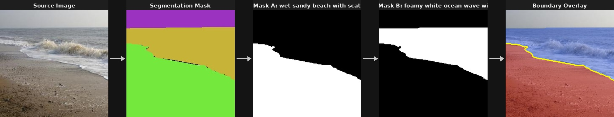
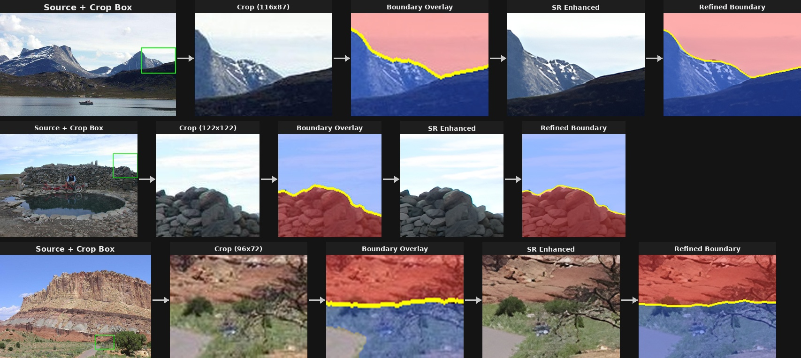
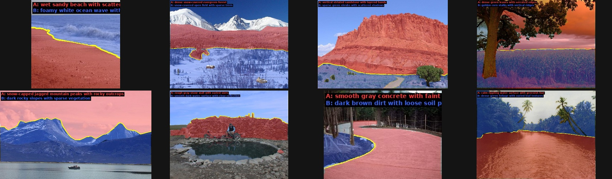

# Texture Boundary Extraction Pipeline

> **Automated extraction of texture transition boundaries from images with colored segmentation masks, powered by Vision-Language Models.**

Given a dataset of images paired with colored segmentation masks (e.g., from ADE20K), this pipeline automatically identifies texture transitions, extracts binary masks for each texture region, crops tight boundary regions, and optionally applies super-resolution refinement — producing training-ready data for texture boundary segmentation models.

<p align="center">
  
</p>

## Key Features

- **VLM-Powered Texture Analysis** — Uses Qwen3-VL (8B/2B) to identify and describe texture transitions from image + mask pairs, producing rich natural-language texture descriptions
- **Robust Mask Extraction** — Color-quantized mask parsing with connected component analysis, adjacency filtering, and deduplication to handle JPEG artifacts and color collisions
- **Intelligent Boundary Cropping** — Top-down binary search with boundary skeletonization to find maximal crop regions centered on texture interfaces, with NMS to remove overlapping crops
- **Color-Based Mask Refinement** — Third-class pixels (belonging to neither texture) are assigned to the nearest texture by Euclidean RGB distance, with an outlier threshold to leave ambiguous pixels unassigned
- **Super-Resolution Enhancement** — Optional Real-ESRGAN 2x upscaling of crops with SDF-based complementary mask smoothing for high-quality training data
- **Resumable Processing** — Incremental saves every 10 images; skips already-processed images on restart

## Pipeline Overview

```
Input                          Processing                         Output
-----                          ----------                         ------
                               +--------------------+
 Source Image  ───────────────>│  Qwen3-VL Analysis  │
 Segmentation Mask ───────────>│  (texture ID +      │
                               │   color matching)   |
                               +--------+-----------+
                                        │
                                        v
                               +--------------------+
                               │  Mask Extraction    │
                               │  - Color quantize   │
                               │  - Adjacency filter │
                               │  - Deduplication    │
                               +--------+-----------+
                                        │
                                        v
                               +--------------------+             images/
                               │  Boundary Cropping  │────────>   masks_texture/
                               │  - Skeleton anchors │            visualizations/
                               │  - Binary search    │            metadata.json
                               │  - NMS              │
                               +--------+-----------+
                                        │
                                        v
                               +--------------------+             crops/images/
                               │  Refinement (opt.)  │────────>   crops/masks_texture/
                               │  - Color reassign   │            crops/visualizations/
                               │  - Real-ESRGAN SR   │            crops/metadata.json
                               │  - SDF smoothing    │
                               +--------------------+
```

## Crop Extraction

The pipeline extracts tight boundary crops around each texture transition using a multi-step algorithm:

1. **Mask Cleaning** — Fill holes, remove small connected components (<50px), morphological smooth
2. **Boundary Skeletonization** — Dilate both masks, find intersection, skeletonize to 1px curve
3. **Anchor Sampling** — Sample points along the skeleton at regular intervals
4. **Binary Search** — For each anchor x aspect ratio, find the largest bounding box where >=90% of pixels belong to the two textures (safe zone)
5. **Scoring** — Rank by boundary density (skeleton pixels / box area) with balance constraint (each texture >= 20%)
6. **NMS** — Remove overlapping crops (IoU > 0.3)
7. **Color Refinement** — Assign third-class pixels to nearest texture by RGB distance

<p align="center">
  
</p>

## Results

<p align="center">
  
</p>

**Pipeline statistics** (on 525 ADE20K images):
| Metric | Value |
|--------|-------|
| Images processed | 455 / 525 (87%) |
| Transitions extracted | 734 |
| Crops extracted (>= 64px) | 1,057 |
| Processing time | ~30 min (RTX 5090) |
| Mean crop size (min side) | 103px input, 206px after SR |

## Installation

### Prerequisites

- Python >= 3.10
- CUDA-capable GPU (16+ GB VRAM recommended for 8B model)

### Setup

```bash
# Clone the repository
git clone https://github.com/<your-org>/texture-boundary-extraction.git
cd texture-boundary-extraction

# Create conda environment
conda create -n texture_boundary python=3.11
conda activate texture_boundary

# Install PyTorch (adjust for your CUDA version)
pip install torch torchvision --index-url https://download.pytorch.org/whl/cu124

# Install dependencies
pip install -r texture_boundary_Architexture/requirements.txt

# (Optional) Install super-resolution support
pip install realesrgan basicsr
```

## Quick Start

### 1. Prepare Your Data

Organize your dataset with paired images and colored segmentation masks:

```
my_dataset/
  images/          # Source photographs
    scene_001.jpg
    scene_002.jpg
    ...
  masks/           # Colored segmentation masks (same filenames)
    scene_001.jpg
    scene_002.jpg
    ...
```

Each mask should be a colored image where distinct RGB colors represent different semantic regions. Common sources include ADE20K, Cityscapes, or any panoptic segmentation output.

### 2. Run the Pipeline

```bash
# Full pipeline with all features
python -m texture_boundary_Architexture.pipeline \
    --data-dir /path/to/my_dataset \
    --exp-name my_experiment

# Quick test on 10 images
python -m texture_boundary_Architexture.pipeline \
    --data-dir /path/to/my_dataset \
    --exp-name test_run \
    --max-images 10

# Without super-resolution (faster, less VRAM)
python -m texture_boundary_Architexture.pipeline \
    --data-dir /path/to/my_dataset \
    --exp-name fast_run \
    --no-refine

# Use smaller model (2B) for limited VRAM
python -m texture_boundary_Architexture.pipeline \
    --data-dir /path/to/my_dataset \
    --exp-name lightweight \
    --model-size 2B \
    --no-refine
```

### 3. Explore Results

```
my_dataset/experiments/my_experiment/
  metadata.json              # Full metadata (all transitions + crops)
  config.json                # Experiment configuration (for reproducibility)
  stats.json                 # Pipeline statistics
  images/                    # Source images (copied)
  masks/                     # Source masks (copied)
  masks_texture/             # Binary masks per texture (PNG, 0/255)
  visualizations/            # Overlay visualizations (red/blue masks + yellow boundary)
  crops/
    metadata.json            # Crop-level metadata (RWTD-compatible)
    images/                  # Cropped image regions
    masks_texture/           # Cropped binary masks
    visualizations/          # Crop overlays
    refined/                 # SR-enhanced versions (if --refine enabled)
      images/
      masks_texture/
      visualizations/
```

### 4. Generate Figures

```bash
python -m texture_boundary_Architexture.scripts.generate_pipeline_figure \
    --exp-dir my_dataset/experiments/my_experiment \
    --output-dir docs/figures
```

## CLI Reference

```
python -m texture_boundary_Architexture.pipeline [OPTIONS]

Required:
  --data-dir PATH        Directory with images/ and masks/ subdirectories

Options:
  --output-dir PATH      Base output directory (default: <data-dir>/experiments)
  --exp-name NAME        Experiment name (default: exp_YYYYMMDD_HHMMSS)
  --max-images N         Process only first N images (for debugging)
  --model-size {8B,2B}   Qwen model size (default: 8B)
  --image-ext EXT        Image file extension (default: jpg)
  --device DEVICE        CUDA device (default: cuda)
  --no-skip              Reprocess all images (don't skip existing)
  --no-viz               Skip visualization generation
  --no-crop              Skip boundary crop extraction
  --no-refine            Skip Real-ESRGAN super-resolution
```

## Metadata Format

Each entry in `metadata.json` follows this structure:

```json
{
  "image_path": "/path/to/image.jpg",
  "mask_a_path": "/path/to/mask_a.png",
  "mask_b_path": "/path/to/mask_b.png",
  "texture_a": "wet sandy beach with scattered pebbles",
  "texture_b": "foamy ocean water with white spray",
  "description": "wet sandy beach with scattered pebbles to foamy ocean water with white spray",
  "oracle_points": {
    "point_prompt_mask_a": [[x1, y1], [x2, y2], ...],
    "point_prompt_mask_b": [[x1, y1], [x2, y2], ...]
  },
  "source_image_id": "scene_001",
  "crops": [
    {
      "crop_index": 0,
      "box": [y1, x1, y2, x2],
      "score": 0.032,
      "crop_image_path": "/path/to/crop.jpg",
      "crop_mask_a_path": "/path/to/crop_mask_a.png",
      "crop_mask_b_path": "/path/to/crop_mask_b.png",
      "crop_size": [width, height],
      "balance": [frac_a, frac_b],
      "oracle_points": { ... }
    }
  ]
}
```

The crop-level `crops/metadata.json` flattens this into one entry per crop for direct use as a training dataset.

## Using with Custom Datasets

The pipeline works with any dataset that provides paired images and colored segmentation masks. Here are some compatible sources:

| Dataset | Mask Type | Notes |
|---------|-----------|-------|
| **ADE20K** | Color-coded semantic masks | Default target; 150 classes |
| **Cityscapes** | Color-coded instance masks | Urban scenes; use `labelIds` images as masks |
| **COCO-Stuff** | Grayscale label maps | Convert to color first with the label colormap |
| **Custom** | Any colored mask | Each distinct RGB = one semantic region |

### Preparing masks from label maps

If your dataset uses grayscale label maps instead of colored masks, convert them first:

```python
import numpy as np
from PIL import Image

# Example: create a random but consistent colormap
np.random.seed(42)
colormap = np.random.randint(0, 255, (256, 3), dtype=np.uint8)
colormap[0] = [0, 0, 0]  # background

label_map = np.array(Image.open("labels.png"))
colored = colormap[label_map]
Image.fromarray(colored).save("masks/scene_001.png")
```

## Architecture

```
texture_boundary_Architexture/
  pipeline.py                     # Main entry point
  config/
    prompts.py                    # VLM prompt templates
  core/
    mask_extraction.py            # Color quantization, binary mask extraction, validation
    deduplication.py              # Mask-level and text-level deduplication
    transition_cropper.py         # Boundary crop extraction (skeleton + binary search + NMS)
    visualization.py              # Overlay generation
    texture_refiner_pipeline.py   # Real-ESRGAN SR + SDF mask smoothing
  models/
    base_vlm.py                   # Abstract VLM interface
    qwen_vlm.py                   # Qwen3-VL implementation (single + batch inference)
    model_factory.py              # Model registry
  utils/
    image_utils.py                # Image I/O helpers
    io_utils.py                   # File system utilities
  scripts/
    download_detecture_data.py    # Download ADE20K-based Detecture dataset
    generate_pipeline_figure.py   # Generate README figures from results
```

## Extending with Other VLMs

The pipeline uses a pluggable VLM interface. To add a new model:

1. Subclass `BaseVLM` in `models/`
2. Implement `load_model()`, `generate()`, and `batch_generate()`
3. Register in `model_factory.py`

```python
from texture_boundary_Architexture.models.base_vlm import BaseVLM

class MyVLM(BaseVLM):
    def load_model(self):
        ...
    def generate(self, image, prompt, max_tokens=512, **kwargs):
        ...
    def batch_generate(self, images, prompts, max_tokens=512, **kwargs):
        ...
```

## Citation

If you use this pipeline in your research, please cite:

```bibtex
@software{texture_boundary_extraction,
  title={Texture Boundary Extraction Pipeline},
  author={},
  year={2025},
  url={https://github.com/<your-org>/texture-boundary-extraction}
}
```

## License

MIT License
